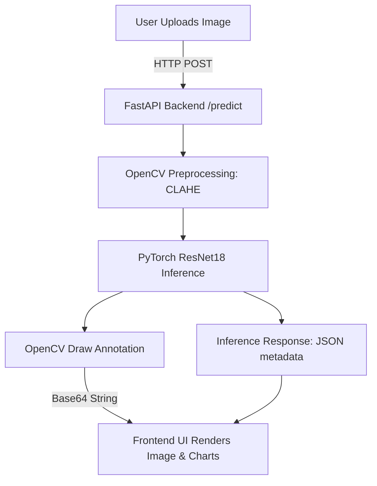

# Plant Disease Detector

An end-to-end Deep Learning and Computer Vision application designed to identify and diagnose crop leaf diseases. This project is built using PyTorch, OpenCV, and FastAPI, featuring a modern glassmorphic web frontend, and is permanently deployed on the cloud.

* **Live Deployment Link:** [https://plant-disease-detector-ozwm.onrender.com](https://plant-disease-detector-ozwm.onrender.com)
* **GitHub Repository:** [https://github.com/Aranya0811/Plant-Disease-Detector](https://github.com/Aranya0811/Plant-Disease-Detector)

---

## 1. Project Overview

Agriculture is highly susceptible to plant diseases, which can devastate crop yields if left unchecked. This project implements a complete Deep Learning pipeline to automate the diagnosis of plant health from leaf images. 

### Key Capabilities:
* **Deep Learning Classifier:** Fine-tuned ResNet18 model classifying 8 distinct crop conditions with **98.54% accuracy**.
* **OpenCV Preprocessing:** Normalizes brightness and details using CLAHE (Contrast Limited Adaptive Histogram Equalization).
* **Optional AI Enhancement (Computer Vision):** Real-time image annotation using OpenCV to draw bounding overlays showing predictions and confidence scores directly on the leaf.
* **FastAPI Backend:** A modular, high-performance web API supporting async request handling and Swagger documentation.
* **Interactive Frontend:** A responsive single-page application styled with glassmorphism for drag-and-drop analysis.

---

## 2. System Architecture & Technical Justification

The project is structured to split concerns cleanly between data management, training pipelines, and API serving. Below are the design decisions made for the system components:



### Preprocessing: Why OpenCV CLAHE?
Outdoor leaf photography suffers from unpredictable lighting conditions (shadows, direct sunlight, camera flash). To ensure the deep learning model focuses on the structural symptoms of diseases (lesions, spot patterns, color rot) rather than lighting noise, we apply **Contrast Limited Adaptive Histogram Equalization (CLAHE)**. This enhances local contrast and details on the leaf texture, improving model robustness.

### Model Choice: Why ResNet18?
For deployment in resource-constrained cloud environments (such as Render's Free Tier with 512 MB RAM), model size and memory footprints are critical. **ResNet18** provides an excellent balance:
* **Inference Speed:** Lightweight enough to run CPU inference in milliseconds.
* **Accuracy:** High representation capacity via transfer learning on ImageNet-1K.
* **Low Footprint:** The PyTorch checkpoint is only **44.8 MB**, preventing memory overload (OOM) during application startup.

### Serving Stack: Why FastAPI?
FastAPI was chosen over Flask or Django due to its native support for asynchronous requests (`async/await`), automatic OpenAPI/Swagger documentation generation, and high performance powered by Uvicorn.

---

## 3. Data Pipeline & Training Workflow

### Dataset Details
The model was trained on a selected subset of the **PlantVillage** dataset, containing 8,234 leaf images categorized into 8 classes:
1. Apple — Apple scab
2. Potato — Early blight
3. Potato — Late blight
4. Potato — healthy
5. Tomato — Early blight
6. Tomato — Late blight
7. Tomato — Leaf Mold
8. Tomato — healthy

### Data Split
The dataset was randomly split using a stratified distribution to maintain class balance:
* **Training Set:** 70% (5,763 samples)
* **Validation Set:** 15% (1,235 samples)
* **Test Set:** 15% (1,236 samples)

### Training Strategy
1. **Feature Extraction (Epochs 1-4):** The ResNet18 convolutional backbone was frozen, and only the custom linear classifier head was trained using the Adam optimizer (\(lr = 10^{-3}\)).
2. **Fine-Tuning (Epochs 5-10):** The backbone layers were unfrozen to allow fine-tuning of deeper convolutional features, utilizing a lower learning rate (\(lr = 10^{-4}\)).

### Evaluation Metrics
The model was evaluated on the independent test set, achieving:
* **Test Accuracy:** `98.54%`
* **Macro F1-Score:** `0.9904`

#### Test Set Classification Report:
```text
                       precision    recall  f1-score   support

   Apple___Apple_scab       1.00      1.00      1.00        94
Potato___Early_blight       1.00      1.00      1.00       150
 Potato___Late_blight       1.00      1.00      1.00       150
     Potato___healthy       1.00      1.00      1.00        23
Tomato___Early_blight       0.97      0.99      0.98       150
 Tomato___Late_blight       0.96      0.98      0.97       287
   Tomato___Leaf_Mold       1.00      1.00      1.00       143
     Tomato___healthy       1.00      0.95      0.97       239

             accuracy                           0.99      1236
```

---

## 4. Directory Structure

```text
├── api/
│   ├── static/               # Frontend Assets (HTML, CSS, JS)
│   │   ├── index.html        # Glassmorphic UI Structure
│   │   ├── style.css         # Custom CSS Variables & Animations
│   │   └── app.js            # Fetch API Integration & Rendering
│   ├── routes/
│   │   └── predict.py        # Prediction endpoints & OpenCV drawing
│   ├── main.py               # FastAPI application initialization
│   └── schemas.py            # API request/response models
├── config.yaml               # Model configuration & hyperparameters
├── data/                     # Local dataset directory (git ignored)
├── Dockerfile                # Production Docker container configuration
├── logs/                     # Saved training curves, CM, and test metrics
├── models/                   # Saved PyTorch checkpoint & class map JSON
├── notebooks/                # Jupyter notebook for local training
├── requirements.txt          # Python dependencies list
├── scripts/                  # EDA and dataset check scripts
└── src/                      # Source modules (dataset loaders, models, training loop)
```

---

## 5. Installation & Local Setup

### Prerequisites
* Python 3.10+ (Tested on Python 3.11/3.14)
* Git

### Step-by-Step Setup
1. **Clone the repository:**
   ```bash
   git clone https://github.com/Aranya0811/Plant-Disease-Detector.git
   cd Plant-Disease-Detector
   ```

2. **Create and activate a virtual environment:**
   * **Windows:**
     ```bash
     python -m venv venv
     .\venv\Scripts\Activate.ps1
     ```
   * **Linux/macOS:**
     ```bash
     python -m venv venv
     source venv/bin/activate
     ```

3. **Install dependencies:**
   ```bash
   pip install -r requirements.txt
   ```

---

## 6. How to Run

### 1. Run Exploratory Data Analysis (EDA)
Scan the downloaded dataset and generate a class distribution chart:
```bash
python -m scripts.eda
```
The resulting chart is saved to `logs/class_distribution.png`.

### 2. Local Model Training
Start the training script inside your virtual environment:
```bash
python -m src.train
```
*Note: Make sure `num_workers: 0` is set in `config.yaml` if running on Windows to prevent multiprocessing hangs.*

### 3. Start the FastAPI Server
Run the FastAPI web server locally:
```bash
uvicorn api.main:app --host 127.0.0.1 --port 8000
```
Open **[http://127.0.0.1:8000/](http://127.0.0.1:8000/)** in your web browser to interact with the frontend.

---

## 7. API Documentation & Examples

FastAPI generates interactive Swagger documentation automatically, which can be viewed at:
* **Swagger UI:** `http://127.0.0.1:8000/docs`

### Core API Endpoints

#### 1. GET `/api/v1/health`
Check backend server status and verify the PyTorch model has loaded correctly.
* **Sample Response:**
  ```json
  {
    "status": "ok",
    "model_loaded": true,
    "num_classes": 8,
    "device": "cpu"
  }
  ```

#### 2. POST `/api/v1/predict/annotated`
Upload an image of a leaf. The server will run model inference and draw a bounding overlay box containing the prediction class and confidence score.
* **Request:** Multipart form upload (`file`).
* **Curl Command Example:**
  ```bash
  curl -X 'POST' \
    'http://127.0.0.1:8000/api/v1/predict/annotated' \
    -H 'accept: application/json' \
    -H 'Content-Type: multipart/form-data' \
    -F 'file=@leaf_image.jpg;type=image/jpeg'
  ```
* **Sample Response:**
  ```json
  {
    "prediction": "Potato — Early blight",
    "plant": "Potato",
    "condition": "Early blight",
    "class_name": "Potato___Early_blight",
    "confidence": 0.9998,
    "is_confident": true,
    "top3": [
      {
        "raw_class": "Potato___Early_blight",
        "plant": "Potato",
        "condition": "Early blight",
        "display_name": "Potato — Early blight",
        "confidence": 0.9998
      }
    ],
    "annotated_image_base64": "/9j/4AAQSkZJRgABAQE...",
    "message": "Prediction drawn on image using OpenCV"
  }
  ```
